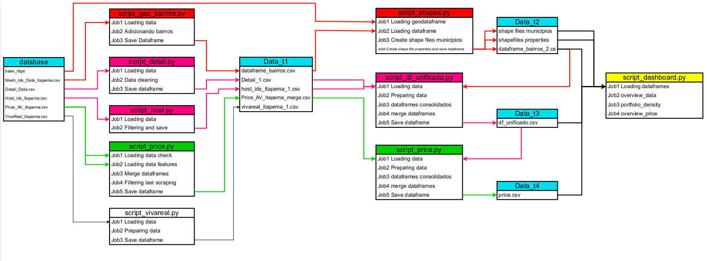

# Seazone Data Science Project 

## O projeto

Este projeto que compõe o meu portfólio profissional apresenta uma solução para um desafio de ciência de dados proposto pela empresa brasileira Seazone.

O projeto está estruturado nos seguintes passos:

1. O Desafio Proposto
2. Configurando o ambiente virtual
3. Executando os Scripts do pipeline de dados.
4. Organização do projeto
4. Planejamento da solução
5. Análise e resultados obtidos
6. Conclusão do projeto
8. Feedback sobre o desafio.
7. Próximos passos

## 1. O Desafio proposto

A Seazone é uma Proptech focada no mercado de Short-Stay Vacation Homes. Este mercado é composto por players como Hóspedes, Anfitriões, Investidores Imobiliários, Construtores e Provedores de Serviços Residenciais. A empresa oferece os seguintes produtos e serviços:
1. Gestão da propriedade
2. Desenvolvimento de Projetos Imobiliários
3. Agência de viagens online (mercado de reservas)
4. Hospedagem Profissional

O objetivo deste desafio é testar as habilidades de programação, raciocínio lógico e capacidade analítica baseado no trabalho realizado pela Seazone, com dados reais. O desafio também busca analisar a estrutura  e eficiência do código (nomes de variáveis, git commits, abstração de função, quanto tempo leva para executar? Quão escalável ele é?), bem como responder a algumas perguntas de negócio a partir de cinco conjunto de dados distintos fornecidos no desafio.

Maiores detalhes sobre o desafio podem ser vistos no seguinte [arquivo.](https://github.com/deivison1983/Seazone_Challenge/blob/main/references/seazone_code_challenge.pdf)

## 2. Configurando o ambiente virtualenv

### Dependências do projeto

O projeto foi desenvolvido com a linguagem de programação Python versão 3.10.7 e algumas bibliotecas podem ser incompatíveis com outras versões.

Todos as bibliotecas do projeto e suas respectivas versões se encontram no arquivo [requirements.txt](https://github.com/deivison1983/Seazone_Challenge/blob/main/requirements.txt).

Os datasets fornecido pela Seazone e utilizados no projeto se encontram armazenados em um link externo a este repositório devido ao tamanho dos arquivos serem superiores ao limite de armazenamento disponibilizado pelo Github.

Ressalta-se que também foram utilizados geodataframes da base do IBGE para confecção do Web App  do projeto.

Todos os [arquivos base](https://1drv.ms/u/s!Aq20zPtPmBa9gWzmRAV5iMAQeIWq?e=ueoUH8) devem ser baixados e armazenados na pasta "data/data_base" do projeto.

### Instalação

Para o correto funcionamento do projeto é necessário clonar este repositório no seu computador. Na raiz da pasta clonada crie o ambiente virtual em python 3.10.7 conforme o sistema operacional do seu computador.

Ative o ambiente virtual conforme o seu sistema operacional.

No terminal atualize o gerenciador de pacotes pip do python.
pip install --upgrade pip

Instalar todas as bibliotecas do projeto conforme arquivo requirements.txt .
pip install -r requirements.txt

## 3.0 Executando os scripts do pipeline de dados.

Após realizar os passos anteriores e com o ambiente virtual ativado executar o arquivo [solution.py](https://github.com/deivison1983/Seazone_Challenge/blob/main/scripts/solution.py) localizado na pasta scripts. Todo o pipeline de dados encontra-se localizado na pasta etl_docs onde é possível verificar o desenho da arquitetura e o arquivo de log do pipeline.

## 4. Organização do projeto

Project
------------

    ├── LICENSE
    │
    ├── README.md          <- Visão geral do projeto e de todas as suas respectivas etapas.
    │
    ├── data
    │   ├── data_base      <- Todos os arquivos fornecido pela Seazone e da base do IBGE.
    │   ├── data_t1        <- Dados transformados.
    │   ├── data_t2        <- Dados transformados.
    │   ├── data_t3        <- Dados transformados.
    │   └── data_t4        <- Dados transformados.
    │
    ├── etl_docs
    │   ├── arquitetura    <- Todos os arquivos fornecido pela Seazone e da base do IBGE.
    │   └── Logs           <- Dados transformados.
    │
    ├── images_readme      <- Jupyter notebooks das análises exploratórias dos dados.
    │
    ├── notebooks          <- Jupyter notebooks das análises exploratórias dos dados.
    │
    ├── references         <- Escopo do projeto, informações fornecidas e complementares
    │
    ├── reports            <- Relatório final do projeto
    │   └── figures        <- Figures used to analyze and create the report.
    │
    ├── requirements.txt   <- Requisitos python e bibliotecas do projeto.
    │
    ├── scripts            <- Códigos fontes utilizados neste projeto.
    │   │
    │   ├── __init__.py    <- Makes scripts a Python module
    │   │
    │   ├── Flow           <- scripts
    │   ├── metodos        <- scripts
    │   │  
    │   │
    │   │
    │   └── visualization  <- script streamlit web app
    │    
    │
    └──

## 5. planejamento da solução

### 5.1 Produtos propostos

Neste projeto foi desenvolvido um pipeline de dados completo em Python à partir de seis datasets distintos, os quais passaram por processo de ETL e servem de base de informação para o funcionamento de um web app hospedado na cloud do Streamlit. O objetivo do Web App é responder as perguntas de negócio propostas no desafio pela equipe da empresa Seazone. Outro produto consiste em um relatório detalhado completo em PDF com todo o roadmap da solução e feedback sobre o desafio.

### 5.2 Ferramentas utilizadas

* Python Packages
* Jupyter Notebook

<table>
  <tbody>
    <tr valign="top">
      <td width="25%" align="center">
        Python  
        
      </td>
      <td width="25%" align="center">
        pandas  
        
      </td>
      <td width="25%" align="center">
        NumPy  
        
      </td>
      <td width="25%" align="center">
        SciPy  
        
      </td>
    </tr>
    <tr valign="top">
      <td width="25%" align="center">
        Matplotlib  
        
      </td>
      <td width="25%" align="center">
        seaborn  
        
      </td>
      <td width="25%" align="center">
        scikit-learn  
        
      </td>
      <td width="25%" align="center">
        XGBoost  
        
      </td>
    <tr valign="top">
    </tr>
    <tr valign="top">
    <td width="25%" align="center">
        CatBoost  
        
      </td>
      <td width="25%" align="center">
        Jupyter  
        
      </td>
      <td width="25%" align="center">
        LGBM  
        
      </td>
    </tr>
  </tbody>
</table>

### 5.3 Processo

O processo utilizado para resolução do problema de negócio segue a metodologia CRIPS-DM. O emprego dessa metodologia nos dá flexibilidade para entregar resultados rápidos e de forma cíclica.

Ao todo a execução da solução do projeto será dividida em 6 passos:

    1. Coleta e Descrição dos dados
    2. Análise exploratória dos dados
    3. Planejamento do pipeline de dados
    4. ETL
    5. Elaboração do web app
    6. Deploy do web app na cloud do Streamlit

## 6. Análise e resultados obtidos

### 6.1 Análise e resultados obtidos - pipeline de dados e Web app

O desafio proposto forneceu cinco datasets distintos como fonte de dados. Além disso, também foi utilizado geodataframes da base do IBGE para confecção da análise geográfica dos imóveis pelos bairros dos municípios. Antes da elaboração do pipeline de dados foi realizada a análise exploratória em cada dataset de forma individualizada. Após essa etapa foi possível compreender o negócio e as conexões dos dados e assim planejar e construir todo o pipeline de dados conforme a figura abaixo:

A "data" desse projeto apresenta outros diretórios onde os dados raw e transformados foram armazenados. Ressalta-se que os dados fornecidos (raw) e descarregados na pasta "data_base" passaram por processos de ETL em vários módulos e consequentemente sendo carregados nos diretórios "data_t1", "data_t2", "data_t3","data_t4". O web app foi desenvolvido em um módulo python separado com todos os recursos da biblioteca Streamlit e utiliza como entrada todos os dados transformados pelos processos de ETL.

O deploy do web app do projeto foi realizado na própria Cloud do Streamlit e encontra-se disponível no endereço: [https://deivison1983-seazone-challenge-scriptsdashboard-1wi5jz.streamlit.app/](https://deivison1983-seazone-challenge-scriptsdashboard-1wi5jz.streamlit.app/) . Ressalta-se que esse deploy foi realizado a partir do arquivo dashboard.py armazenado na pasta "scripts" do repositório do projeto na plataforma github. Para testar localmente o web app no seu computador é necessário rodar o arquivo dashboard.py diretamente da pasta "scripts" do seu projeto. No terminal, com o ambiente virtual do projeto ativo e dentro da referida pasta digitar o comando "streamlit run dahsboard.py" . Outras informações sobre os diretórios do projeto foram detalhadas no item "3.0 Executando os scripts do pipeline de dados".

O web app possui quatro blocos distintos:
1. Data Oveview
2. Region Overview
3. Análise econômica
4. Respondendo as perguntas de negócios

A seção "Data Overwiew" apresenta um abordagem geral sobre as informações consolidas dos cinco datasets fornecidos no desafio. Na seção "Region Overview" é possível fazer uma análise geográfica visual dos imóveis em um mapa interativo, onde é possível verificar quantos imóveis há disponíveis por bairro e município da base. A análise econômica por bairro apresentou alguns indicadores sobre os bairros com maiores taxas de ocupação ao longo de um ano, maiores tarifas diárias médias mensal de ocupação, além dos maiores faturamentos.

### 6.2 Business Performance

Ressalta-se que foi possível responder as seguintes perguntas de negócio abaixo:

1. Qual o melhor perfil de imóvel para investir na cidade?
* O melhor perfil consiste em apartamentos com 3 quartos, 2 banheiros e com garagem

2. Qual é a melhor localização na cidade em termos de receita?
* Imóveis localizados no bairro Centro de Itapema possuem a melhor localização em termos de receita.

3. Quais são as características e razões para as melhores receitas da cidade?
* Imóveis localizados no bairro Centro de Itapema possuem maiores faturamentos anual por imóvel, por anúncio e por diárias consolidadas.Além disso, a tarifa diária média mensal ao longo do ano foi a maior entre os bairros.
* Em termos de faturamento anual bruto, os 291 imóveis ficaram na segunda posição em volume.
* O terceiro quartil dos imóveis localizados no Centro contemplam o perfil de apartamentos com 3 quartos, 2 banheiros e com garagem.

## 7. Conclusão do projeto
Após todo o desenvolvimento desse primeiro ciclo desse projeto (CRISP-DM), o produto de dados proposto como solução do problema de negócio do desafio respondeu a três perguntas de negócio. O web app encontra-se disponível no [endereço](https://deivison1983-seazone-challenge-scriptsdashboard-1wi5jz.streamlit.app/), onde é possível verificar a análise econômica do projeto. Ressalta-se que no web app há outros detalhes sobre os conjuntos de dados fornecidos e também é possível realizar uma análise geográfica dos imóveis pelos bairros dos municípios existentes na base de dados.

## 8. Feedback sobre o desafio.

O desafio proposto foi muito bem elaborado tendo em vistas os seus objetivos conforme descrito no item 1. Destaca-se que o dataset "Price_AV_Itapema.csv" possui mais de 43 milhões linhas e onze variáveis distintas sendo o seu tamanho próximo aos 5 Giga Bytes, o que demanda maiores atenções nas etapas de carregamento, limpeza e manipulação dos dados. Salienta-se que algumas variáveis do dataset "Details_Data.csv" ofereceram um desafio a mais nas etapas de limpeza e manipulação de strings devido o agrupamento de muitas informações coletadas por meio de web scraping nos sites Airbnb e Viva Real. Os datasets "Price_AV_Itapema.csv" e "Details_Data.csv" não possuem identificadas as importantes variáveis de localização "bairro" e "município". A identificação foi realizada por meio das coordenadas de latitude e longitude fornecidas no dataset "Mesh_Ids_Data_Itapema.csv", o que demandou a utilização da biblioteca Nominatim do Python para obtenção das informações. Essa biblioteca faz o processo de identificação das coordenadas via requisição em API o que necessita de alguns minutos até a completa identificação dos bairros e cidades de todos os imóveis. O planejamento e elaboração do pipeline de dados tornou o desafio bastante interessante, pois para a construção da análise de negócio e econômica é necessário consolidar as informações das diferentes fontes de dados.

## 9. Próximos passos

Após a primeira entrega é possível seguir por vários caminhos distintos nos próximos ciclos do CRISP-DM. Geralmente essa decisão poderá ser pautada por novas demandas em função da motivação da equipe de ciência de dados.

Destacamos as seguintes possibilidades de caminhos:

* Construir novas hipóteses de negócios com objetivos de entender o comportamento de mercado.
* Realizar uma nova análise exploratória de dados com o objetivo de entender e quais novas variáveis macroeconômicas podem ser utilizadas.
* Construção de modelos de Machine Learning para prever o faturamento dos imóveis.

### Autor

Deivison Morais. Visite o meu portfólio de projetos [aqui.](https://deivison1983.github.io/portfolio_projetos/)

### Contatos

  
  

